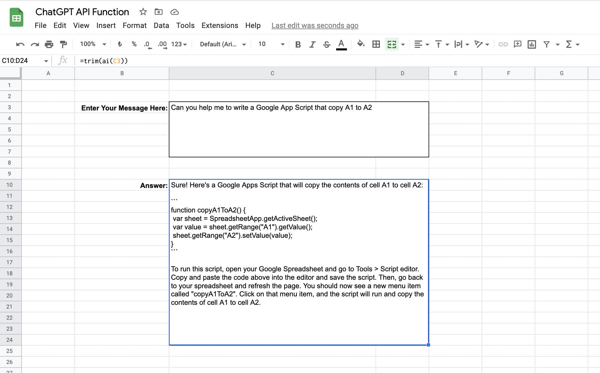

# ChatGPT2GoogleSheets
Easily use ChatGPT API in Google Spreadsheet

You can use ChatGPT via new ChatGPT API (https://openai.com/blog/introducing-chatgpt-and-whisper-apis) on spreadsheet. with =ai(message")

How to use:

1) Extension > App Script
2) Copy the code from ai.py and paste there. 
3) Click Save
4) Go To Spreasheet back
5) use =ai("Your Message")

Example:

Also you can just copy my Spreadsheet file and edit the API Key: https://docs.google.com/spreadsheets/d/1f1SfC5ErD9rFzqOxMrvXdpts1kJF6uk2c25oTaT0sOM/edit

Note: I am not a proggemmer, most of the code of this project created by ChatGPT. 
